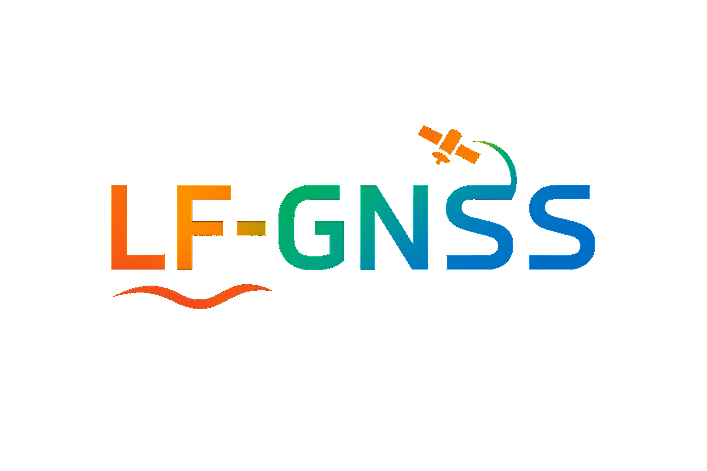

# 🛰️ LF-GNSS: A Fundamental Framework for Exploring Learning and Filtering Integration in GNSS
<p align="center">
  
</p>

---

## 🧑‍💻 Framework Overview

LF-GNSS is an open-sourced framework designed to explore the integration of deep learning and filtering in satellite positioning. Fully developed in Python and built on PyTorch, the released implementation supports both model training and inference. It serves as a flexible research foundation for integrating AI and GNSS technologies, helping researchers and developers investigate and refine the fusion of deep learning and filtering techniques within the GNSS domain. We hope this framework will encourage further exploration and development in the intersection of satellite navigation and artificial intelligence.

Below is an overview of the key components in the codebase, explaining the main modules and their functions.

### 1. **`config/`** - Configuration Files

This directory contains configuration files for the LF-GNSS framework. These files are used to set up and customize the system according to your specific research or application needs.

### 2. **`gnss_foundation/`** - GNSS Data Processing and Core Utilities

This directory contains essential modules for GNSS data processing, including ephemeris handling, GNSS signal definitions, and utilities for working with RINEX files. These modules are based on and modified from the **[cssrlib](https://github.com/hirokawa/cssrlib)** library.

### 3. **`neural_network/`** - Neural Network Models and Loss Functions

This directory contains modules related to the design and implementation of neural network models and custom loss functions. You can customize and extend the models here according to your specific needs.

- **`__init__.py`**: Initializes the `neural_network` package and provides necessary imports for model training and evaluation.
- **`losses.py`**: Defines the loss functions used in the neural network models. Feel free to explore and modify this file to suit the needs of your specific application.
- **`models.py`**: Contains the architecture of the neural network models. You are encouraged to freely modify and extend this file to implement custom neural network architectures tailored to your application.

This directory allows flexibility for users to define and experiment with different model architectures and loss functions tailored to their GNSS processing tasks.

### 4. **`tools/`** - Utility Scripts for Data Visualization and Analysis

This directory contains utility scripts for visualizing and analyzing the results. You are free to place your own evaluation tools here to suit your specific needs, enabling custom analyses and visualizations tailored to your workflow.

- **`plot_enu_error.py`**: A script for plotting the East-North-Up error in positioning. This tool helps visualize the accuracy and performance of the GNSS system in different coordinate axes, enabling quick assessments of system performance.


### 5. **`trained_model/`** - Directory for Storing Trained Models

This directory is used for storing the trained models. These models have been trained on relevant datasets and are ready for use in inference or further fine-tuning based on your specific research needs. You can also add your own trained models here, allowing easy integration and reuse.

### 6. **`gnss_dataset.py`** - Dataset Handling

This file contains the logic for managing datasets. It includes functions for loading, processing, and managing data such as observation files, ephemeris, and ground truth. It plays a critical role in preparing the data before feeding it into model training.

### 7. **`gnss_engine.py`** - Core GNSS Engine

This module contains the core functions for satellite positioning. It implements the fundamental calculations required for GNSS positioning. Several new functions have been added based on `cssrlib`, along with adaptations for PyTorch.

### 8. **`gnss_util.py`** - Utility Functions for GNSS Processing

This module provides a collection of utility functions for GNSS processing, including coordinate transformations and data handling. It features functions for coordinate system transformations and calculating the errors between predicted and ground truth positions. The module also includes functions for signal conversion, reading observation and navigation data, and validating and testing models. These functions are essential for supporting the GNSS signal processing pipeline, with support for both NumPy and PyTorch.

### 9. **`LF-GNSS_Train.py`** - Model Training Module

This module is responsible for training models. It handles the integration of datasets, defines model architectures, and runs the training procedure. You can explore and experiment with different architectures and training configurations, allowing you to train new models or fine-tune existing ones with specific datasets.

### 10. **`LF-GNSS_Test.py`** - Model Evaluation Module

This module is used for evaluating the performance and accuracy of the models. It runs predefined tests with test data, comparing the model's outputs to expected results, allowing you to assess the system's functionality and overall performance. You can also integrate visualization techniques to enhance the evaluation, providing graphical representations of model performance and error analysis.

---

## 🛠️ Installation Guide

### Setting Up the Conda Environment

To get started with LF-GNSS, you will first need to set up a Conda environment to manage the necessary dependencies. Follow these steps to create a dedicated environment for LF-GNSS.

#### Step 1: Install Conda (if not installed)

If you haven't already installed Conda, download and install [Miniconda](https://docs.conda.io/en/latest/miniconda.html) or [Anaconda](https://www.anaconda.com/products/individual). Miniconda is a minimal installer, while Anaconda comes with a set of pre-installed packages.

#### Step 2: Create a New Conda Environment

To create a new Conda environment (We have tested this on Ubuntu 20.04 with Python 3.10.4 and an NVIDIA GeForce RTX 4090 GPU). Please run the following command:

```bash
conda create --name lf-gnss python=3.10.4
```

This will create a new environment named lf-gnss. You can replace lf-gnss with any name you prefer for your environment.


#### Step 3: Activate the Conda Environment
Once the environment is created, activate it using the following command:

```bash
conda activate lf-gnss
```

#### Step 4: Clone the repository from GitHub

```bash
git clone https://github.com/garlanlou/LF-GNSS.git
cd LF-GNSS
```

#### Step 5: Install Required Dependencies

You can now install all necessary dependencies. The environment will include packages such as PyTorch, NumPy, SciPy, and others necessary for both training and inference.

Run the following command to install the core dependencies:

```bash
conda install -c conda-forge pytorch numpy scipy matplotlib pandas
```

Additionally, we have provided a requirements.txt file that includes other necessary dependencies for LF-GNSS, including any additional Python packages needed for GNSS data processing and deep learning tasks. To install these dependencies, simply run the following command:

```bash
pip install -r requirements.txt
```

#### Step 6: Prepare the Dataset

Once the environment is set up and verified, you can proceed to explore the LF-GNSS framework. We provide example datasets to help you get started quickly. You can access the dataset at [LF-GNSS-Dataset](https://github.com/GarlanLou/LF-GNSS-Dataset).

To get started, create a `data` folder in your project directory and place the dataset files there. The dataset should be organized in the following way:

```
project_directory/
└───data/
    ├── LF-GNSS_eph.24p
    ├── LF-GNSS_groundtruth.txt
    └── LF-GNSS_obs.24o
```

#### Step 7: Start Training

Run the following command to begin training:
```bash
python LF-GNSS_Train.py LF-GNSS
```

You can also add your own dataset in `LF-GNSS_Trian.py`. For example, if you have a dataset called A-GNSS, you can add it as follows:
```
dataset_configs = {
    "Your-GNSS": {
        "train": "config/Your-GNSS-train.json",
        "val1": "config/Your-GNSS-A.json",
        "val2": "config/Your-GNSS-B.json",
    }
}
```
Run the following command to begin your own training:

```bash
python LF-GNSS_Train.py Your-GNSS
```

#### Step 8: Start Testing

Once the model is trained, it will be saved in the `trained_model` directory. To help you quickly test the module, we provide an example model, `example_model.pth`. You can proceed with testing by using the following command:

```bash
python LF-GNSS_Test.py
```

The evaluation results will be saved in the `lf-gnss_results` directory. Corresponding datasets, such as LF-GNSS-A, will have their own dedicated subfolders within the results directory.

Once you have trained your own model on your custom dataset, simply update the `MODEL_PATH` to point to your trained model, and modify the `VAL_CONFIG_PATH` to use the appropriate configuration file for your validation set.

```
# ==================== Configuration ====================
MODEL_PATH = "trained_model/example_model.pth"  # Path to trained model. An example model is provided; you can use this code to test your own models.
VAL_CONFIG_PATH = "config/LF-GNSS-A.json"   # Validation configuration file
OUTPUT_DIR = "lf-gnss_results"              # Output directory for results
# ======================================================
```

#### Step 9: Evaluate the Results

Once the testing is complete, you can use the script to evaluate the results of the model. We provide example results obtained using tools such as gogps, cssrlib, rtklib, and tdlgnss, which you can use as references for comparison. These example results are stored in the `baseline_results` directory. To evaluate the results, simply run the following command:
```bash
python tools/plot_enu_error.py 
```
---

## 🌟 Written at the end

1. **Acknowledgments and Gratitude**

    We would like to begin by expressing our gratitude to the **[TDL-GNSS](https://github.com/ebhrz/TDL-GNSS)** repository. Its tremendous contributions to advancing the integration of AI with GNSS technologies have inspired us to create LF-GNSS.

    Additionally, we would like to express our gratitude to the **[cssrlib](https://github.com/hirokawa/cssrlib)** library. Its key resources and algorithms have been essential in implementing various GNSS models and foundational tools that support our work. Their contributions have been invaluable in helping us develop and refine the LF-GNSS framework.

2. **Future Optimization Directions**

    This framework is an open-source foundational version. While we have laid the groundwork, we acknowledge that the framework is still in its early stages and there are numerous areas for improvement. Due to the inherent limitations of our current capabilities, we encourage the community of researchers and developers to optimize the neural network models and introduce new GNSS-related factors to enhance the framework's generalization ability and overall performance. This openness allows for continuous improvements and innovations, and we believe that future developments, such as integrating multi-frequency observations, Doppler measurements, and carrier phase, will contribute to the framework's evolution.

    We also encourage users to train their own models using their own data, enabling tailored solutions that better meet specific requirements and research needs. This flexibility promotes personalized innovation and allows the community to push the boundaries of the framework's capabilities.

3. **Real-Time Applications and Future Prospects**

    While real-time applications in the GNSS field are still predominantly implemented in C++, LF-GNSS is developed in Python, utilizing PyTorch for model training, which offers a flexible and efficient platform for experimentation and development. To facilitate deployment on embedded systems, we encourage the community to leverage ONNX for exporting trained models. This enables the generation of C++ code for real-time applications, allowing the models to be efficiently deployed on embedded devices.

    We acknowledge that Python's real-time performance may currently have limitations, but by leveraging tools like ONNX and the ongoing improvements in hardware and software optimization, we believe the gap between Python’s capabilities and real-time requirements will continue to narrow, making real-time applications more feasible in the future.

4. **A Vision for the Future**

    We believe that the integration of AI with any field holds immense creative potential. With this in mind, we hope this foundational version will inspire a community of researchers, engineers, and enthusiasts who will collectively shape the future of GNSS, artificial intelligence, and integrated navigation systems.

## 📧 Feel Free to Contact Us

As we continue to explore the intersection of neural networks and navigation systems, we welcome anyone who shares our passion for these fields to engage in ongoing discussions. If you're interested, please feel free to reach out via email using the contact information provided on the Github homepage. We are happy to respond to any inquiries.

<!-- # ## 🔥 Updates

# - **[Oct 2025]** Paper accepted by *IEEE Transactions on Instrumentation and Measurement (IEEE T-IM)* 🎉  
# - **[Dec 2025]** The codebase and related datasets are being organized and will be uploaded soon.

--- -->
